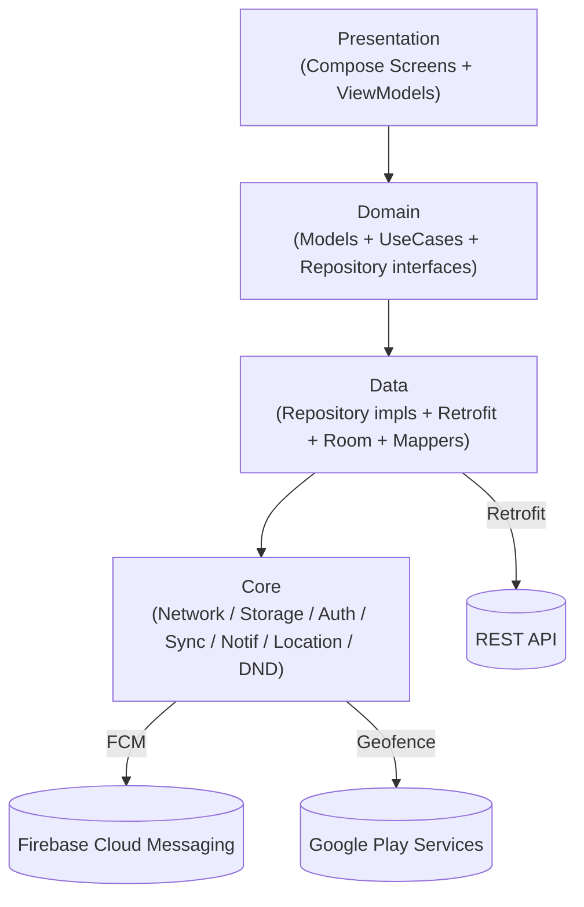
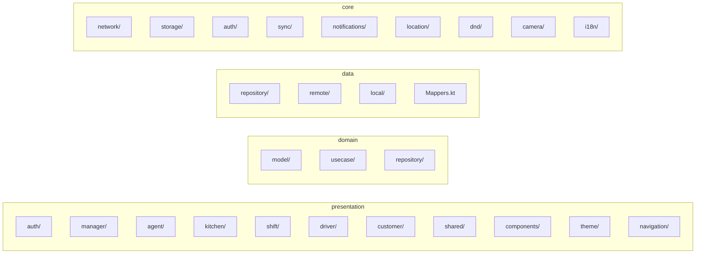
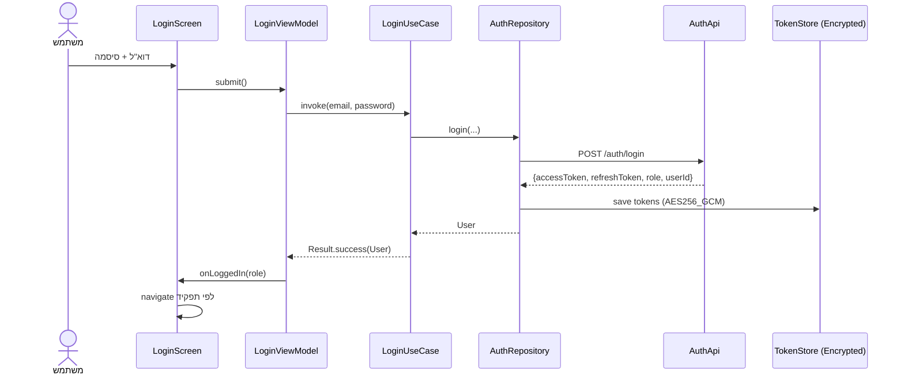
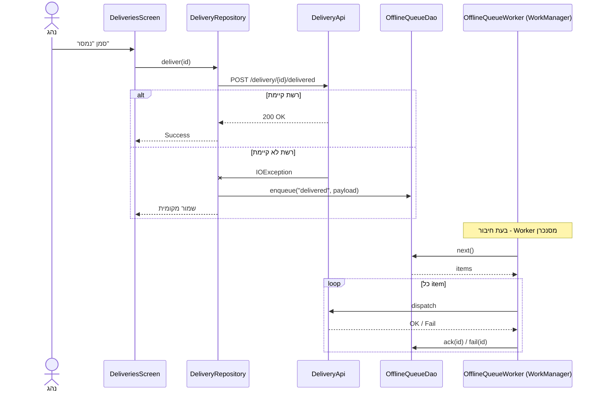
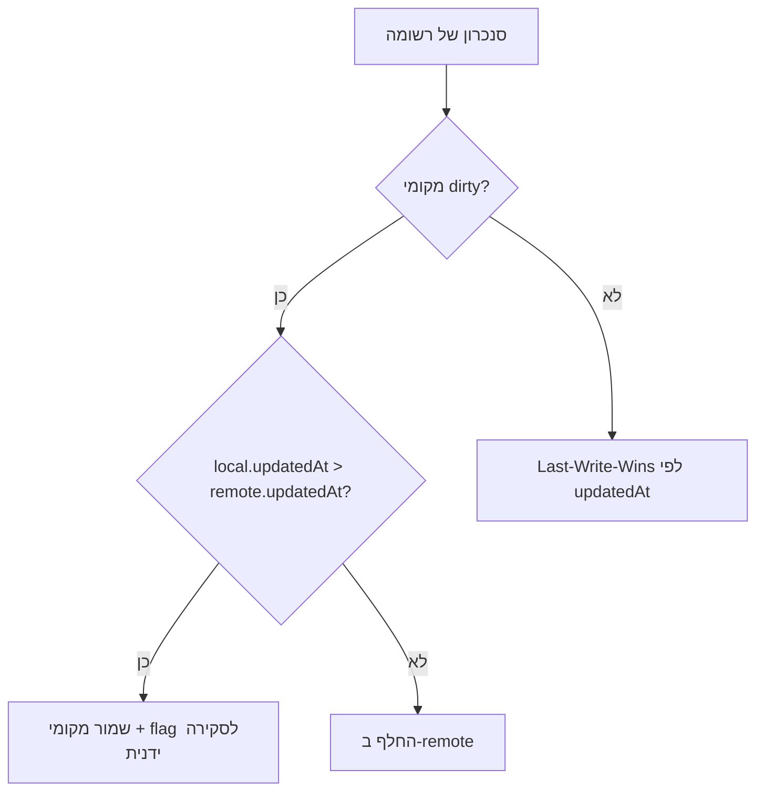
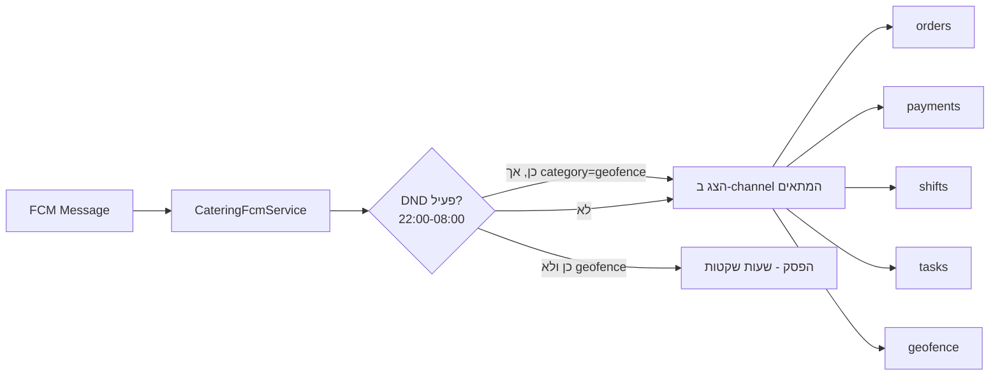
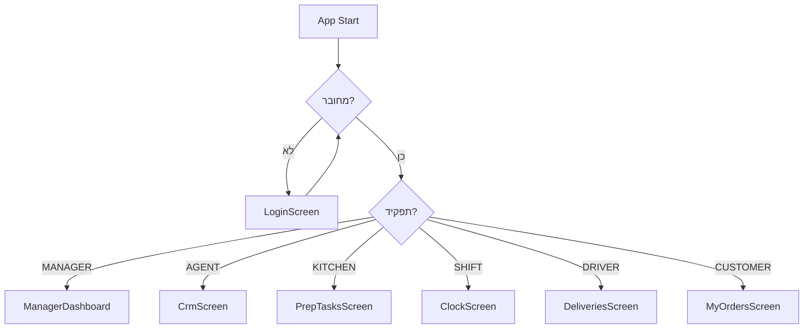

# ארכיטקטורה - אפליקציית קייטרינג

מסמך זה מתאר את החלוקה לשכבות, את זרימות הנתונים, ואת הקבצים המרכזיים בכל שכבה. כל הדיאגרמות ב-Mermaid.

---

## סקירה - שכבות

- **Presentation** - לא יודע על Retrofit/Room. רק מודלי Domain.
- **Domain** - אינו תלוי באנדרואיד פרט ל-Coroutines + Flow.
- **Data** - מממש את ה-interfaces של Domain. מנהל cache/queue.
- **Core** - תשתית: HTTP client, DB, EncryptedSharedPreferences, ערוצי התראות.

---

## חבילה (Package) מרכזיות

---

## זרימת התחברות

---

## זרימת Offline-First (פעולה ללא רשת)

---

## פתרון קונפליקטים

האסטרטגיה: **last-write-wins על בסיס updatedAt + flag להתערבות ידנית** במקרה ש-`dirty` ועדיין מאוחר יותר מהשרת. לוגיקה ב-`ConflictResolver`.

---

## ערוצי התראות

---

## ניווט לפי תפקיד

---

## טבלת קבצים מרכזיים

| תחום | קבצים |
|------|-------|
| Application | `CateringApp.kt`, `MainActivity.kt` |
| Network | `core/network/AuthInterceptor.kt`, `TokenAuthenticator.kt`, `ApiResult.kt`, `di/NetworkModule.kt` |
| Auth | `core/auth/TokenStore.kt`, `BiometricAuthenticator.kt`, `data/repository/AuthRepositoryImpl.kt` |
| DB | `core/storage/CateringDatabase.kt`, `entity/*`, `data/local/*Dao.kt` |
| Sync | `core/sync/OfflineQueueManager.kt`, `OfflineQueueWorker.kt`, `ConflictResolver.kt` |
| Notifications | `core/notifications/NotificationChannels.kt`, `CateringFcmService.kt`, `core/dnd/DndGate.kt` |
| Location | `core/location/LocationProvider.kt`, `GeofenceManager.kt`, `GeofenceBroadcastReceiver.kt` |
| Camera+OCR | `core/camera/CameraXManager.kt`, `data/remote/OcrApi.kt`, `presentation/screens/shared/CameraOcrScreen.kt` |
| Signature | `presentation/components/SignaturePad.kt`, `presentation/screens/driver/SignatureScreen.kt` |
| i18n | `core/i18n/RtlHelpers.kt`, `res/values-he/strings.xml`, `res/xml/locales_config.xml` |

