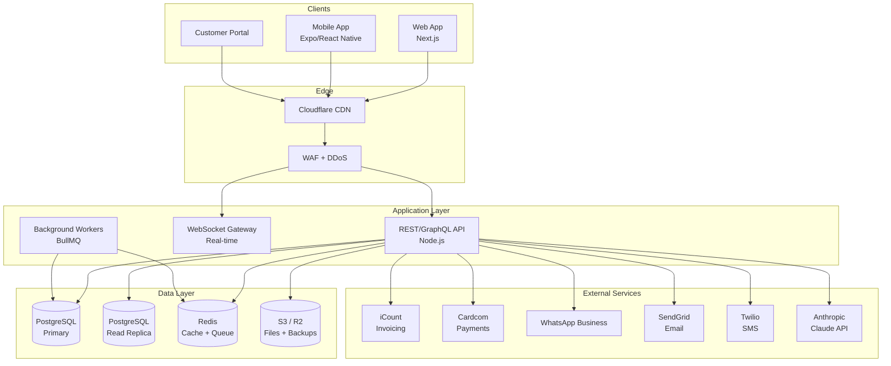
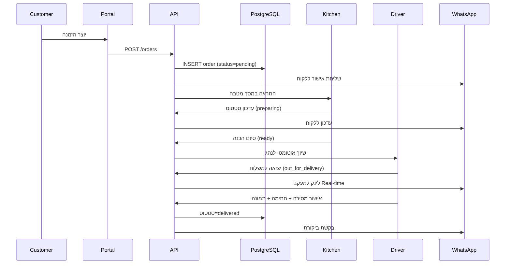
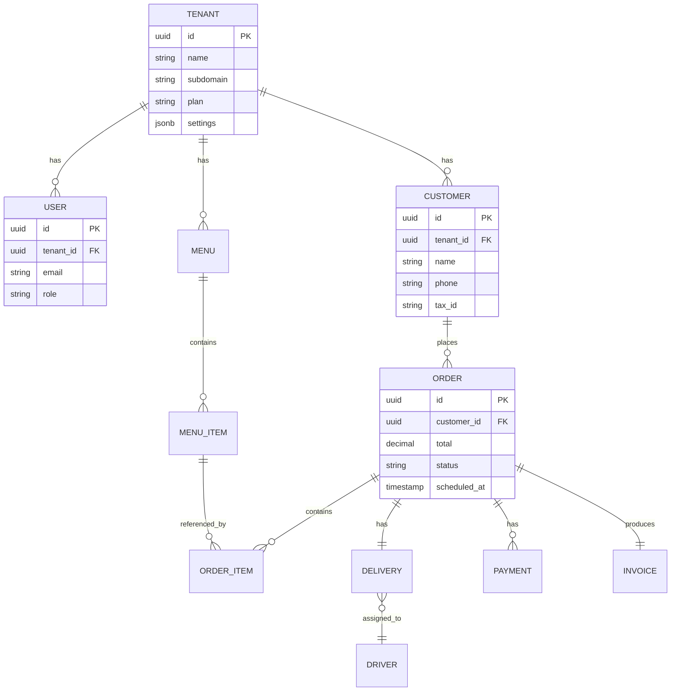
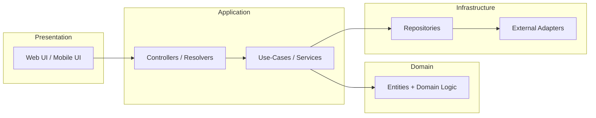
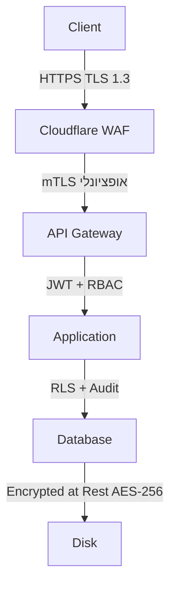
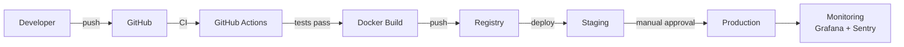

# 02 — ארכיטקטורת המערכת

## 1. תרשים מערכת כללי (High-Level Architecture)

## 2. תרשים זרימת הזמנה (Order Flow)

## 3. מודל נתונים — ישויות עיקריות (ERD)

## 4. שכבות (Layered Architecture)

## 5. Multi-Tenancy

- **Shared DB, Shared Schema** עם הפרדה מלאה ב-`tenant_id` בכל טבלה
- **Row-Level Security (RLS)** ב-PostgreSQL כשכבת הגנה שנייה
- **Tenant-aware Middleware** חולץ את ה-tenant מ-JWT / subdomain
- **Plan-based Feature Flags** — חבילות תכונות לפי תוכנית

## 6. אבטחה (Security Layers)

- Authentication: JWT + Refresh Token
- Authorization: RBAC + ABAC (Attribute-Based)
- Secrets: Vault / Doppler (לא ב-Git)
- Audit Log: כל פעולה רגישה נשמרת ב-immutable log
- Rate Limiting: 100 req/min לכל user, 1000 req/min לכל tenant

## 7. Deployment

## 8. Observability

- **Logs** — structured JSON, נשלח ל-Loki
- **Metrics** — Prometheus + Grafana
- **Traces** — OpenTelemetry → Tempo
- **Errors** — Sentry
- **Uptime** — UptimeRobot / BetterStack

