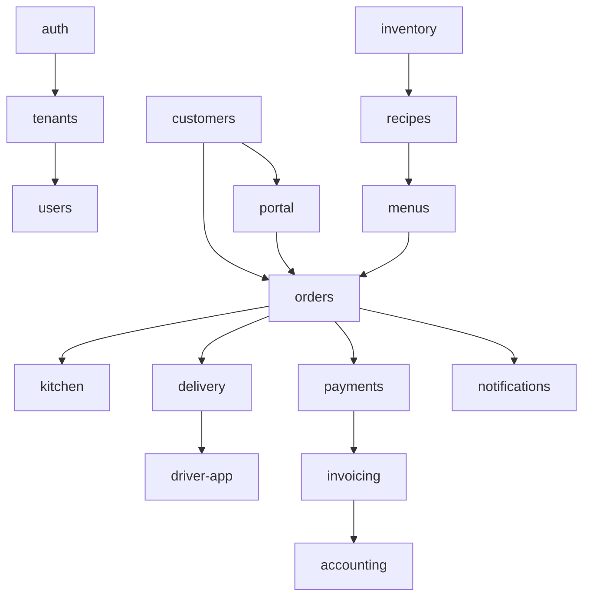

# 03 — קטלוג מודולים (25)

לכל מודול: מטרה, מסכים עיקריים, hooks/services.

---

## 1. Auth & Identity (`auth`)
**מטרה:** התחברות, הרשמה, ניהול סשנים, MFA, SSO.
**מסכים:** Login, Signup, ForgotPassword, MFASetup, SessionManager.
**Hooks/Services:** `useAuth`, `useSession`, `authService.login()`, `authService.refresh()`.

## 2. Tenants & Workspaces (`tenants`)
**מטרה:** ניהול ארגונים מרובים, ברנדינג, תוכניות.
**מסכים:** TenantSettings, BrandingEditor, PlanUpgrade.
**Hooks:** `useTenant`, `useFeatureFlag`, `tenantService.switch()`.

## 3. Users & Roles (RBAC) (`users`)
**מטרה:** ניהול משתמשים פנימיים, תפקידים והרשאות.
**מסכים:** UsersList, UserEdit, RolesMatrix, PermissionsGrid.
**Hooks:** `useUsers`, `useRole`, `useHasPermission(scope, action)`.

## 4. Customers (CRM) (`customers`)
**מטרה:** ניהול לקוחות עסקיים ופרטיים, היסטוריה, הערות.
**מסכים:** CustomersList, CustomerProfile, OrderHistory, NotesTimeline.
**Hooks:** `useCustomers`, `useCustomerProfile`, `customerService.merge()`.

## 5. Leads & Opportunities (`crm-pipeline`)
**מטרה:** ניהול לידים, פייפליין מכירות, סטטוס סגירה.
**מסכים:** PipelineBoard (Kanban), LeadDetail, ConversionFunnel.
**Hooks:** `useLeads`, `usePipeline`, `crmService.convertLeadToCustomer()`.

## 6. Menus & Catalog (`menus`)
**מטרה:** ניהול תפריטים, קטגוריות, מנות, מחירונים.
**מסכים:** MenusList, MenuEditor, ItemModal, PriceLists.
**Hooks:** `useMenus`, `useMenuItem`, `menuService.duplicate()`.

## 7. Inventory & Stock (`inventory`)
**מטרה:** מלאי חומרי גלם, ספירות, התראות מינימום.
**מסכים:** StockList, StockCount, LowStockAlerts, MovementLog.
**Hooks:** `useStock`, `useStockMovements`, `inventoryService.adjust()`.

## 8. Suppliers & Purchasing (`suppliers`)
**מטרה:** ניהול ספקים, הזמנות רכש, קבלת סחורה.
**מסכים:** SuppliersList, PurchaseOrders, GoodsReceipt.
**Hooks:** `useSuppliers`, `usePurchaseOrder`, `poService.send()`.

## 9. Recipes & BOM (`recipes`)
**מטרה:** מתכונים, מבנה מנה (Bill of Materials), עלות מנה.
**מסכים:** RecipesList, RecipeEditor, CostCalculator.
**Hooks:** `useRecipes`, `useRecipeCost`, `recipeService.calcCost()`.

## 10. Orders (`orders`)
**מטרה:** ניהול הזמנות מקצה לקצה.
**מסכים:** OrdersBoard, OrderDetail, NewOrderWizard, EditOrder.
**Hooks:** `useOrders`, `useOrder`, `orderService.confirm()`, `orderService.cancel()`.

## 11. Kitchen Display System (KDS) (`kitchen`)
**מטרה:** מסך תצוגה למטבח, תורי הכנה, בקרת זמנים.
**מסכים:** KitchenBoard, StationView, ItemTicket.
**Hooks:** `useKitchenQueue`, `kdsService.bump()`, `kdsService.recall()`.

## 12. Production Planning (`production`)
**מטרה:** תכנון ייצור יומי/שבועי לפי הזמנות.
**מסכים:** ProductionPlan, BatchSheet, PrepList.
**Hooks:** `useProductionPlan`, `productionService.generate()`.

## 13. Delivery & Routing (`delivery`)
**מטרה:** ניהול משלוחים, מסלולים אוטומטיים.
**מסכים:** DeliveryBoard, RouteMap, DriverAssignment.
**Hooks:** `useDeliveries`, `useRouteOptimizer`, `routingService.optimize()`.

## 14. Driver Mobile App (`driver-app`)
**מטרה:** אפליקציית נהג — קבלת מסלול, מסירה, חתימה.
**מסכים:** TodayRoute, StopDetail, ProofOfDelivery, Navigation.
**Hooks:** `useMyRoute`, `useStop`, `driverService.completeStop()`.

## 15. Customer Portal (`portal`)
**מטרה:** פורטל לקוח להזמנה עצמית.
**מסכים:** Home, MenuBrowse, Cart, Checkout, MyOrders, MyAccount.
**Hooks:** `usePublicMenu`, `useCart`, `portalService.placeOrder()`.

## 16. Payments (`payments`)
**מטרה:** סליקה, החזרים, תשלומים חוזרים.
**מסכים:** PaymentsList, RefundModal, RecurringPayments.
**Hooks:** `usePayments`, `paymentService.charge()`, `paymentService.refund()`.

## 17. Invoicing (`invoicing`)
**מטרה:** חשבוניות מס/קבלה, אינטגרציה ל-iCount.
**מסכים:** InvoicesList, InvoiceDetail, BulkInvoicing.
**Hooks:** `useInvoices`, `invoiceService.create()`, `invoiceService.send()`.

## 18. Accounting Sync (`accounting`)
**מטרה:** סנכרון לחשבונאות חיצונית.
**מסכים:** SyncDashboard, ExportLog, MismatchReport.
**Hooks:** `useAccountingSync`, `accountingService.export()`.

## 19. Notifications Engine (`notifications`)
**מטרה:** WhatsApp / SMS / Email / Push, תבניות.
**מסכים:** TemplatesEditor, NotificationLog, ChannelSettings.
**Hooks:** `useTemplates`, `notifyService.send()`, `notifyService.schedule()`.

## 20. Reports & BI (`reports`)
**מטרה:** דוחות, KPIs, חיתוכים.
**מסכים:** ReportsHub, DashboardBuilder, ExportCenter.
**Hooks:** `useReport`, `useDashboard`, `reportService.run()`.

## 21. Audit & Compliance (`audit`)
**מטרה:** Audit Log, GDPR, מחיקת נתונים.
**מסכים:** AuditLog, DataExport, RightToBeForgotten.
**Hooks:** `useAuditLog`, `auditService.export()`.

## 22. Settings & Preferences (`settings`)
**מטרה:** הגדרות מערכת, חגים, שעות פעילות.
**מסכים:** GeneralSettings, BusinessHours, Holidays, TaxRates.
**Hooks:** `useSettings`, `settingsService.update()`.

## 23. Integrations Hub (`integrations`)
**מטרה:** חיבור לשירותים חיצוניים, ניהול API Keys.
**מסכים:** IntegrationsList, KeyVault, WebhooksManager.
**Hooks:** `useIntegrations`, `useWebhooks`, `integrationsService.test()`.

## 24. Employees & Shifts (`hr-light`)
**מטרה:** ניהול עובדים, משמרות, נוכחות (לא שכר).
**מסכים:** EmployeesList, ShiftScheduler, TimeClock.
**Hooks:** `useEmployees`, `useShifts`, `hrService.clockIn()`.

## 25. Support & Tickets (`support`)
**מטרה:** מערכת תמיכה פנימית ללקוחות.
**מסכים:** TicketsList, TicketDetail, KnowledgeBase.
**Hooks:** `useTickets`, `supportService.assign()`, `supportService.close()`.

---

## תלויות בין מודולים

