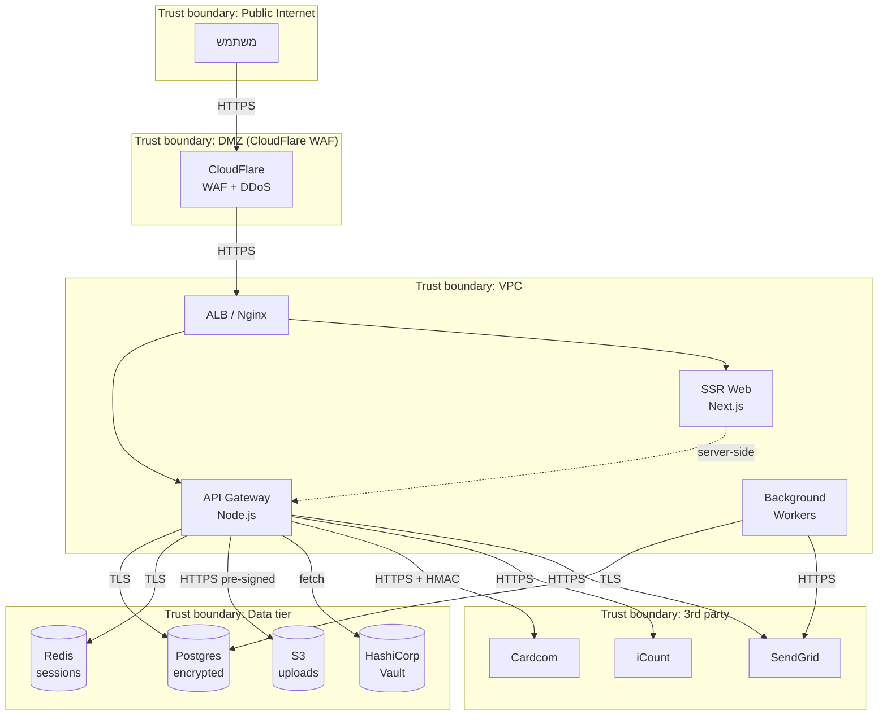
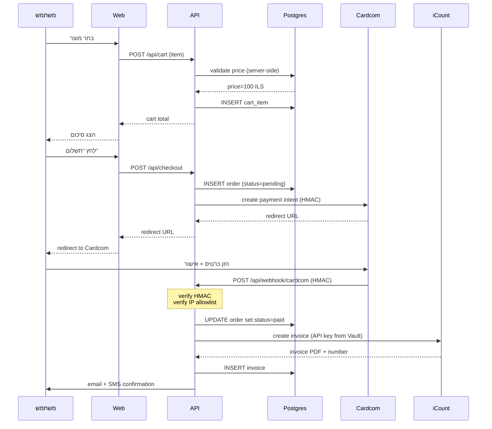

<div dir="rtl">

# Data Flow Diagram (DFD)

תיאור זרימת נתונים במערכת + trust boundaries לזיהוי איומים.

## רמה 0 — Context Diagram

```mermaid
flowchart LR
    User[משתמש קצה<br/>Browser/Mobile] -->|HTTPS| App[האפליקציה]
    Admin[מנהל מערכת] -->|HTTPS + 2FA| App
    App -->|API| Cardcom[Cardcom<br/>סליקה]
    App -->|API| Icount[iCount<br/>חשבונאות]
    App -->|SMTP/API| SendGrid
    App -->|API| SMS019[019 SMS]
    Researcher[חוקר אבטחה] -.->|disclosure| Sec[security@]
```

## רמה 1 — האפליקציה הפנימית



## רמה 2 — תהליך הזמנה ותשלום



## Trust Boundaries — נקודות בדיקה

| גבול | מאיים אפשרי | בדיקה נדרשת |
|---|---|---|
| Public → WAF | DDoS, scrapers, bots | rate-limit, CAPTCHA |
| WAF → LB | התחזות לקליינט | mTLS פנימי |
| LB → API | unauthorized | auth middleware |
| API → DB | SQL injection | parameterize |
| API → S3 | path traversal | pre-signed URLs only |
| API → Vault | sprawl of secrets | least-privilege policy |
| API → 3rd party | מפתחות API דלפו | rotate + monitor |
| 3rd party → API (webhook) | spoofing | HMAC + IP whitelist |

## רגישות נתונים

| סוג | סיווג | הצפנה at-rest | הצפנה in-transit | שמירה |
|---|---|---|---|---|
| ת"ז | סודי ביותר | AES-256-GCM + KMS | TLS 1.3 | מינימום |
| חשבון בנק | סודי ביותר | AES-256-GCM + KMS | TLS 1.3 | מינימום |
| כרטיס אשראי | PCI | לא נשמר אצלנו (PCI tokenization) | TLS 1.3 | n/a |
| שכר | סודי | AES-256-GCM | TLS 1.3 | 7 שנים |
| חשבונית | סודי | AES-256 | TLS 1.3 | 7 שנים |
| email/phone | פנימי | rest-only encrypted | TLS 1.3 | עד מחיקת חשבון |
| audit_log | פנימי | encrypted | TLS 1.3 | 7 שנים, immutable |

</div>
